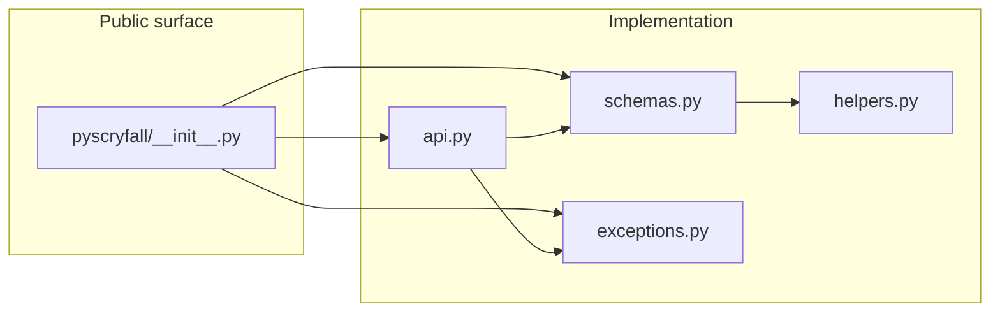
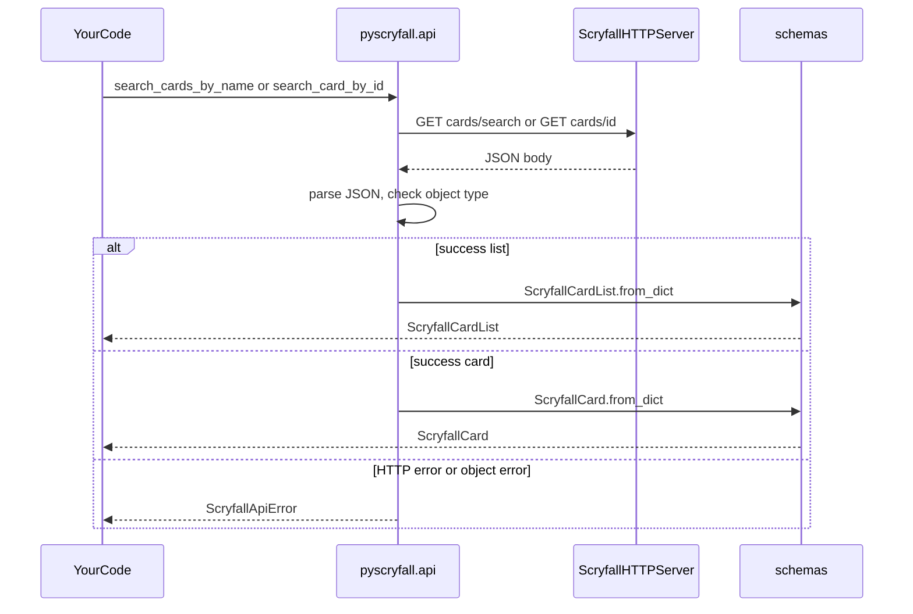
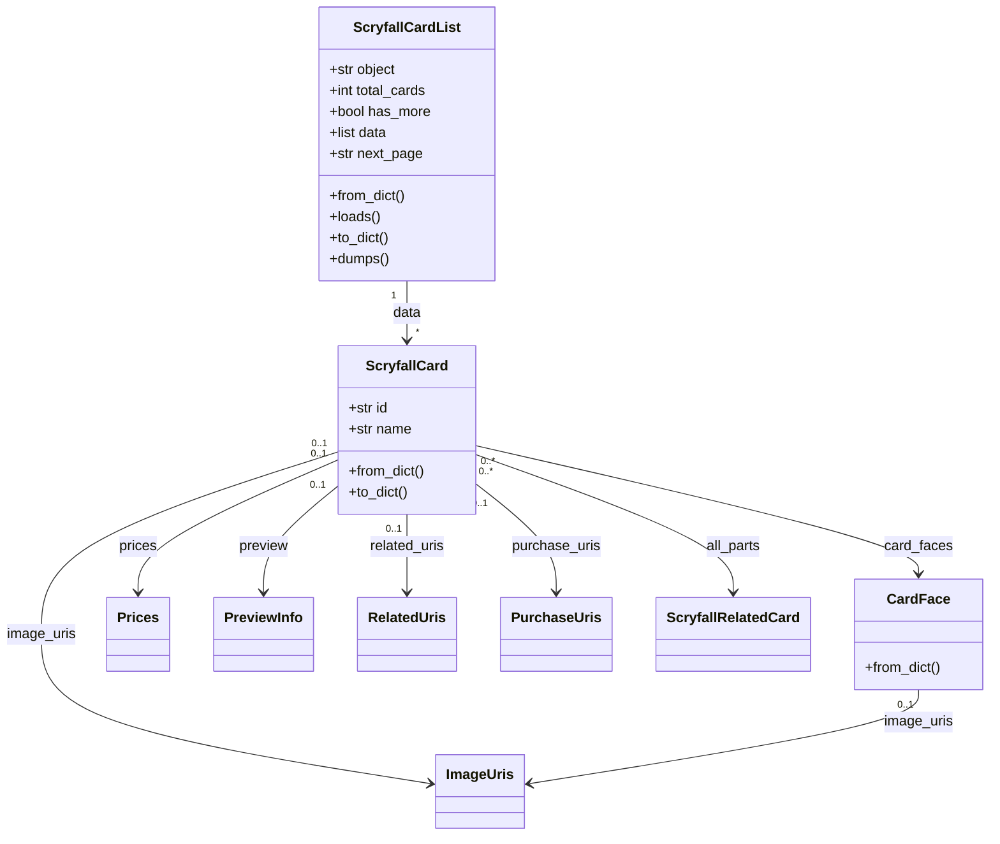

# PyScryfall: A WIP/unofficial Scryfall API Wrapper

Python client for the [Scryfall](https://scryfall.com/) REST API: search Magic: The Gathering cards by name or Scryfall ID and work with typed card payloads (`dataclass` models).

**Requirements:** Python 3.12+, [`requests`](https://requests.readthedocs.io/). Network access is required for live API calls.

## Installation

Using [uv](https://docs.astral.sh/uv/) (recommended for this repo):

```bash
uv sync
```

That creates or updates `.venv`, installs runtime dependencies, and includes the `dev` dependency group (pytest) by default via `default-groups` in `pyproject.toml`.

To install only production dependencies in another workflow, use your tool’s equivalent of installing the `pyscryfall` project with its `[project] dependencies`.

## Package layout

The library lives under **`src/pyscryfall/`** on disk. After `uv sync` or `pip install`, you import it as **`pyscryfall`**. Modules split **HTTP entry points**, **typed JSON models**, **errors**, and **internal parsing helpers**.

Repository layout (high level):

```
src/pyscryfall/    # installable package (api, schemas, exceptions, helpers, __init__)
tests/
pyproject.toml
```



| Module | Role |
|--------|------|
| **`pyscryfall.api`** | `GET` requests to Scryfall, JSON parsing, validation of `object` field, construction of `ScryfallCard` / `ScryfallCardList`. |
| **`pyscryfall.schemas`** | Dataclasses mirroring Scryfall card and list JSON; `from_dict` / `to_dict` (and list `loads` / `dumps`). |
| **`pyscryfall.exceptions`** | `ScryfallApiError` for HTTP failures and API error payloads; `ScryfallErrorBody` for structured error fields. |
| **`pyscryfall.helpers`** | Internal helpers (`_optional_model`, `_list_of`, …) used by `schemas`; not part of the public `__all__`. |

The package root re-exports the search functions, core card types, and exceptions (see `src/pyscryfall/__init__.py` `__all__`).

## API and data flow

High-level flow from your code to typed objects:



- **`search_cards_by_name(name, …)`** → [`GET /cards/search`](https://scryfall.com/docs/api/cards/search) with a `name:"…"` query (quotes escaped). Returns **`ScryfallCardList`** (first page only; use `next_page` if you implement pagination).
- **`search_card_by_id(card_id, …)`** → [`GET /cards/:id`](https://scryfall.com/docs/api/cards/id). Returns a single **`ScryfallCard`**.

Both accept optional `session` (`requests.Session`) and `timeout`. Base URL defaults to `https://api.scryfall.com`; override with environment variable **`SCRYFALL_BASE_URL`** (e.g. for tests or mocks).

## Class and composition model

`ScryfallCard` is the main aggregate: many optional fields and nested dataclasses. `ScryfallCardList` wraps a page of cards.



Errors from the library use **`ScryfallApiError`**: message, optional **`http_status`**, and optional **`body`** (`ScryfallErrorBody` with `code`, `details`, `status`, etc.) when Scryfall returns an error object.

## Usage examples

### Search by name (all prints on the first page)

```python
from pyscryfall import search_cards_by_name, ScryfallCardList

result: ScryfallCardList = search_cards_by_name("Lightning Bolt")
print(result.total_cards, result.has_more)
for card in result.data:
    print(card.name, card.set_name, card.collector_number)
```

Optional arguments match Scryfall’s search API (see docstrings): e.g. `unique="prints"`, `order="released"`.

### Fetch a single card by Scryfall ID

```python
from pyscryfall import search_card_by_id, ScryfallCard

card: ScryfallCard = search_card_by_id("de652420-eacf-4f9d-9f13-c6bc02b0fa72")
print(card.name, card.type_line, card.oracle_text)
```

### Handle API and HTTP errors

```python
from pyscryfall import search_card_by_id, ScryfallApiError

try:
    search_card_by_id("00000000-0000-0000-0000-000000000000")
except ScryfallApiError as exc:
    print(exc)
    print(exc.http_status)
    if exc.body:
        print(exc.body.code, exc.body.details)
```

### Custom session or timeout

```python
import requests
from pyscryfall import search_cards_by_name

session = requests.Session()
session.headers["User-Agent"] = "MyApp/1.0"
cards = search_cards_by_name("Island", session=session, timeout=60.0)
```

### Serialize models

```python
from pyscryfall import search_card_by_id

card = search_card_by_id("de652420-eacf-4f9d-9f13-c6bc02b0fa72")
payload = card.to_dict()
```

For a stored JSON string of a **list** response, `ScryfallCardList.loads(s)` and `ScryfallCardList.dumps()` are available on the list type.

## Running tests

Tests live under `tests/` and call the **real** Scryfall API, so they need network access.

With uv (from the repository root):

```bash
uv sync
uv run pytest
```

Verbose output:

```bash
uv run pytest -v
```

`uv sync` installs this project in editable mode so `import pyscryfall` works. Pytest is configured in `pyproject.toml` with `testpaths = ["tests"]` and `pythonpath = ["."]`.

## References

- [Scryfall API documentation](https://scryfall.com/docs/api)
