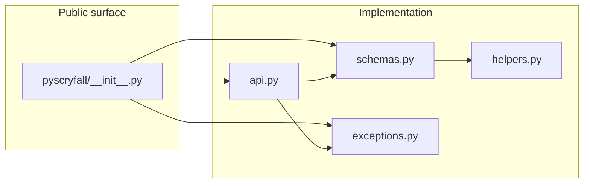
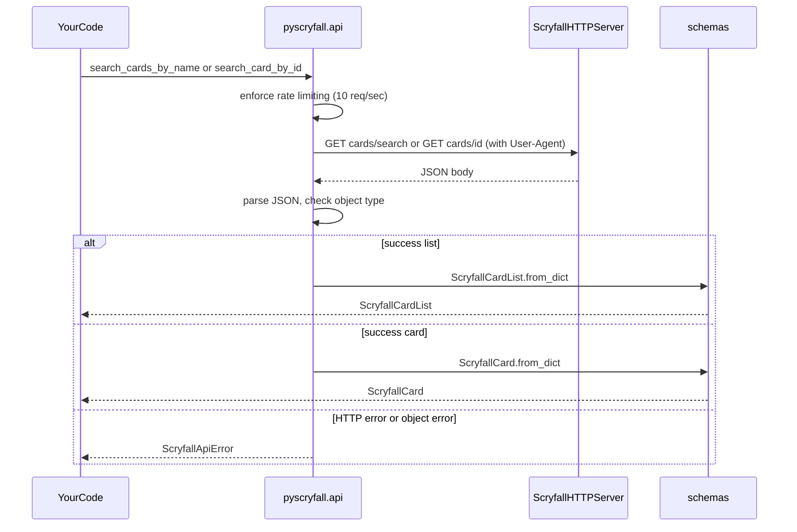
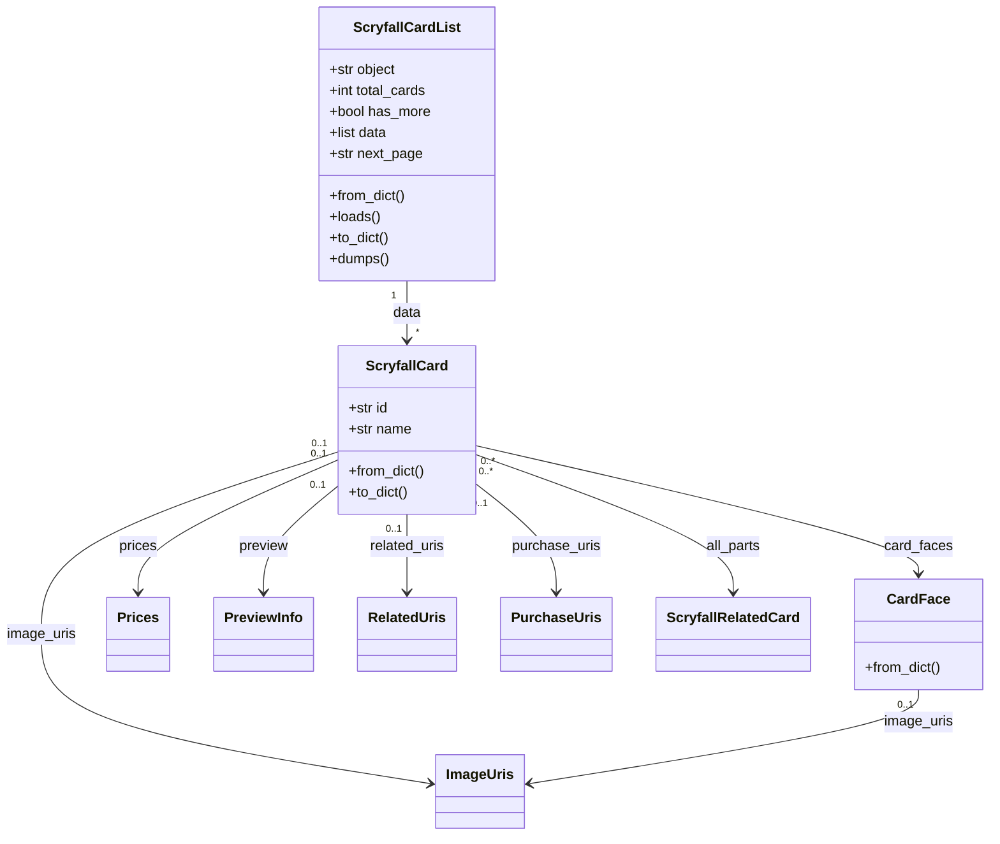

# PyScryfall: A WIP/unofficial Scryfall API Wrapper

Python client for the [Scryfall](https://scryfall.com/) REST API: search Magic: The Gathering cards by name or Scryfall ID and work with typed card payloads (`dataclass` models). Fully compliant with Scryfall API guidelines including rate limiting and required headers.

**Requirements:** Python 3.12+, [`requests`](https://requests.readthedocs.io/). Network access is required for live API calls.

## Installation

Using [uv](https://docs.astral.sh/uv/) (recommended for this repo):

```bash
uv sync
```

That creates or updates `.venv`, installs runtime dependencies, and includes the `dev` dependency group (pytest) by default via `default-groups` in `pyproject.toml`.

To install only production dependencies in another workflow, use your tool’s equivalent of installing the `pyscryfall` project with its `[project] dependencies`.

## Package layout

The library lives under **`src/pyscryfall/`** on disk. After `uv sync` or `pip install`, you import it as **`pyscryfall`**. Modules split **HTTP entry points**, **typed JSON models**, **errors**, and **internal parsing helpers**.

Repository layout (high level):

```
src/pyscryfall/    # installable package (api, schemas, exceptions, helpers, __init__)
tests/
pyproject.toml
```



| Module | Role |
|--------|------|
| **`pyscryfall.api`** | `GET` requests to Scryfall, JSON parsing, validation of `object` field, construction of `ScryfallCard` / `ScryfallCardList`. |
| **`pyscryfall.schemas`** | Dataclasses mirroring Scryfall card and list JSON; `from_dict` / `to_dict` (and list `loads` / `dumps`). |
| **`pyscryfall.exceptions`** | `ScryfallApiError` for HTTP failures and API error payloads; `ScryfallErrorBody` for structured error fields. |
| **`pyscryfall.helpers`** | Internal helpers (`_optional_model`, `_list_of`, …) used by `schemas`; not part of the public `__all__`. |

The package root re-exports the search functions, core card types, and exceptions (see `src/pyscryfall/__init__.py` `__all__`).

## API and data flow

High-level flow from your code to typed objects:



### Core Search Functions

- **`search_cards_by_name(name, …)`** → [`GET /cards/search`](https://scryfall.com/docs/api/cards/search) with a `name:"…"` query (quotes escaped). Returns **`ScryfallCardList`** (first page, up to 175 cards).
- **`search_card_by_id(card_id, …)`** → [`GET /cards/:id`](https://scryfall.com/docs/api/cards/id). Returns a single **`ScryfallCard`**.

### Named Search Functions

- **`search_card_by_name_exact(name, …)`** → [`GET /cards/named?exact=`](https://scryfall.com/docs/api/cards/named) for exact name matching. Returns a single **`ScryfallCard`**.
- **`search_card_by_name_fuzzy(name, …)`** → [`GET /cards/named?fuzzy=`](https://scryfall.com/docs/api/cards/named) for fuzzy matching (handles typos). Returns a single **`ScryfallCard`**.

### Pagination

- **`search_cards_by_name_all(name, …)`** → Generator that automatically follows `next_page` URLs to yield all matching cards across all pages.

### Other Endpoints

- **`get_random_card(q=None, …)`** → [`GET /cards/random`](https://scryfall.com/docs/api/cards/random) with optional query filter.
- **`autocomplete_card_name(q, …)`** → [`GET /cards/autocomplete`](https://scryfall.com/docs/api/cards/autocomplete) for name suggestions. Returns **`ScryfallCatalog`**.
- **`get_card_rulings(card_id, …)`** → [`GET /cards/:id/rulings`](https://scryfall.com/docs/api/cards/rulings). Returns **`ScryfallRulingList`**.

All functions accept optional `session` (`requests.Session`) and `timeout`. Base URL defaults to `https://api.scryfall.com`; override with environment variable **`SCRYFALL_BASE_URL`** (e.g. for tests or mocks).

## Class and composition model

`ScryfallCard` is the main aggregate: many optional fields and nested dataclasses. `ScryfallCardList` wraps a page of cards.



Errors from the library use **`ScryfallApiError`**: message, optional **`http_status`**, and optional **`body`** (`ScryfallErrorBody` with `code`, `details`, `status`, etc.) when Scryfall returns an error object.

## Usage examples

### Search by name (first page)

```python
from pyscryfall import search_cards_by_name, ScryfallCardList

result: ScryfallCardList = search_cards_by_name("Lightning Bolt")
print(result.total_cards, result.has_more)
for card in result.data:
    print(card.name, card.set_name, card.collector_number)
```

Optional arguments match Scryfall’s search API (see docstrings): e.g. `unique="prints"`, `order="released"`.

### Exact and fuzzy name search

```python
from pyscryfall import search_card_by_name_exact, search_card_by_name_fuzzy

# Exact match (case-insensitive)
card = search_card_by_name_exact("Lightning Bolt")
print(card.name)

# Fuzzy match (handles typos and partial names)
card = search_card_by_name_fuzzy("Lightn Bolt")  # finds Lightning Bolt
print(card.name)

# Restrict to specific set
card = search_card_by_name_exact("Lightning Bolt", set_code="m21")
print(card.set_name)
```

### Fetch all pages with pagination

```python
from pyscryfall import search_cards_by_name_all

# Generator yields cards from all pages
for card in search_cards_by_name_all("Island", unique="prints"):
    print(card.set_name, card.collector_number)
    
# Or collect all at once
cards = list(search_cards_by_name_all("Island", unique="prints"))
print(f"Found {len(cards)} total printings")
```

### Fetch a single card by Scryfall ID

```python
from pyscryfall import search_card_by_id, ScryfallCard

card: ScryfallCard = search_card_by_id("de652420-eacf-4f9d-9f13-c6bc02b0fa72")
print(card.name, card.type_line, card.oracle_text)
```

### Random card

```python
from pyscryfall import get_random_card

# Get any random card
card = get_random_card()
print(card.name)

# Get random card matching a query
creature = get_random_card(q="t:creature")
print(creature.type_line)

# Random legendary from a specific set
legendary = get_random_card(q="t:legendary set:war")
print(legendary.name)
```

### Autocomplete card names

```python
from pyscryfall import autocomplete_card_name

suggestions = autocomplete_card_name("Lightning")
print(suggestions.data)  # ["Light", "Lightning Bolt", "Lightning Strike", ...]

# Include extra cards (tokens, etc.)
all_suggestions = autocomplete_card_name("Thopter", include_extras=True)
```

### Card rulings

```python
from pyscryfall import search_card_by_name_exact, get_card_rulings

card = search_card_by_name_exact("Humility")
rulings = get_card_rulings(card.id)

for ruling in rulings.data:
    print(f"{ruling.published_at}: {ruling.comment}")
```

### Handle API and HTTP errors

```python
from pyscryfall import search_card_by_id, ScryfallApiError

try:
    search_card_by_id("00000000-0000-0000-0000-000000000000")
except ScryfallApiError as exc:
    print(exc)
    print(exc.http_status)
    if exc.body:
        print(exc.body.code, exc.body.details)
```

### Custom session or timeout

```python
import requests
from pyscryfall import search_cards_by_name

session = requests.Session()
session.headers["User-Agent"] = "MyApp/1.0 (contact@example.com)"
cards = search_cards_by_name("Island", session=session, timeout=60.0)
```

**Note:** The library automatically sets a User-Agent header (`pyscryfall/0.2.0`), but you can override it by providing a custom session with your own User-Agent.

### Serialize models

```python
from pyscryfall import search_card_by_id

card = search_card_by_id("de652420-eacf-4f9d-9f13-c6bc02b0fa72")
payload = card.to_dict()
json_string = card.to_json()

# Deserialize
from pyscryfall import ScryfallCard
card = ScryfallCard.from_json_string(json_string)
```

For a stored JSON string of a **list** response, `ScryfallCardList.from_json_string(s)` and `to_json()` are available on the list type.

## Rate limiting and API compliance

This library follows Scryfall's API guidelines:

### Automatic rate limiting

The library automatically enforces Scryfall's **10 requests/second** limit by adding a small delay between requests. This is transparent and requires no configuration.

Override the delay with the `SCRYFALL_RATE_LIMIT_DELAY` environment variable (in seconds):

```bash
export SCRYFALL_RATE_LIMIT_DELAY=0.15  # 150ms = ~6.7 req/sec
```

Rate limiting is shared across all API calls in the process.

### User-Agent header

All requests automatically include a `User-Agent: pyscryfall/0.2.0` header as required by Scryfall.

To use a custom User-Agent (e.g., for your application):

```python
import requests
from pyscryfall import search_cards_by_name

session = requests.Session()
session.headers["User-Agent"] = "MyApp/1.0 (contact@example.com)"
cards = search_cards_by_name("Island", session=session)
```

### Error handling

The library properly handles API error responses with structured error information:

```python
from pyscryfall import search_card_by_name_exact, ScryfallApiError

try:
    card = search_card_by_name_exact("NonexistentCard12345")
except ScryfallApiError as e:
    print(f"HTTP Status: {e.http_status}")
    if e.body:
        print(f"Error Code: {e.body.code}")
        print(f"Details: {e.body.details}")
```

## Running tests

Tests live under `tests/` and call the **real** Scryfall API, so they need network access.

With uv (from the repository root):

```bash
uv sync
uv run pytest
```

Verbose output:

```bash
uv run pytest -v
```

`uv sync` installs this project in editable mode so `import pyscryfall` works. Pytest is configured in `pyproject.toml` with `testpaths = ["tests"]` and `pythonpath = ["."]`.

## References

- [Scryfall API documentation](https://scryfall.com/docs/api)

## AI Disclosure

This is *not* a vibe-coded project, but parts of this project has been developed with the help of an AI Model. Specifically, I am working with a locally-hosted [Qwen-3.6-35B-A3B-GGUF](https://huggingface.co/unsloth/Qwen3.5-35B-A3B-GGUF) via llama.cpp on my M1 Pro Macbook Pro

AI has been helpful during the initial implementation phases and to basically write all API schemas.
